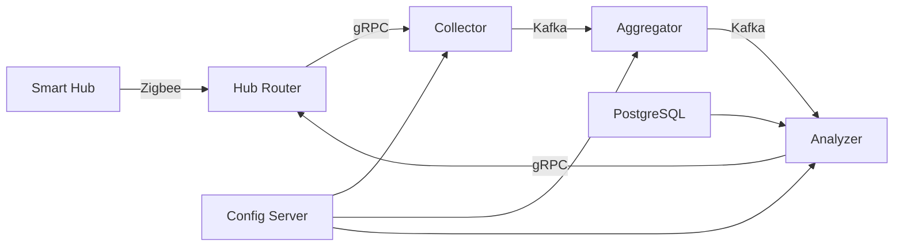

# Smart Home Telemetry Analysis Platform

Проект представляет собой платформу для сбора, обработки и анализа телеметрии умных устройств в экосистеме "Умного дома".

## 📌 Общее описание

Разработка системы для управления умными устройствами (датчики движения, освещения, температуры). Платформа:
- Принимает данные от домашних хабов
- Обрабатывает и агрегирует телеметрию
- Автоматически запускает сценарии на основе показаний датчиков

## 🏗 Архитектура системы


	
## 🏗 Основные микросервисы

### Hub Router (реализован)
- **Функции**:
  - Принимает данные от домашних хабов
  - Конвертирует в унифицированный формат

### Collector
- **Функции**:
  - Принимает данные от Hub Router
  - Конвертирует в Avro
  - Сохраняет в Kafka

### Aggregator
- **Функции**:
  - Агрегирует данные по хабам
  - Сохраняет снимки состояний в Kafka

### Analyzer
- **Функции**:
  - Анализирует данные
  - Запускает сценарии при выполнении условий

## 🛠 Технологический стек

| Компонент             | Технология         |
|-----------------------|--------------------|
| Языки программирования| Java (Spring Boot) |
| Брокер сообщений      | Apache Kafka       |
| Сериализация         | Apache Avro        |
| RPC                  | gRPC               |
| База данных          | PostgreSQL         |
| Service Discovery    | Eureka             |
| Конфигурация         | Spring Cloud Config|

## 📋 Поддерживаемые устройства

| Категория      | Устройства                     |
|----------------|-------------------------------|
| **Управление** | Хаб                           |
| **Освещение**  | Умные лампы (вкл/выкл)        |
| **Электропитание** | Умные розетки, выключатели |
| **Безопасность** | Датчики движения           |
| **Комфорт**    | Датчики температуры, освещения|

## 📊 Пример потока данных

```mermaid
sequenceDiagram
    participant Хаб
    participant HubRouter
    participant Collector
    participant Kafka
    participant Aggregator
    participant Analyzer
    
    Хаб->>HubRouter: Данные устройств (Zigbee)
    HubRouter->>Collector: gRPC-запрос
    Collector->>Kafka: Avro-сообщение
    Kafka->>Aggregator: Сырые данные
    Aggregator->>Kafka: Агрегированные данные
    Kafka->>Analyzer: Снимок состояния
    Analyzer->>HubRouter: Команды сценариев (gRPC)
	```