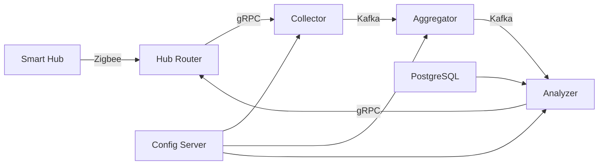
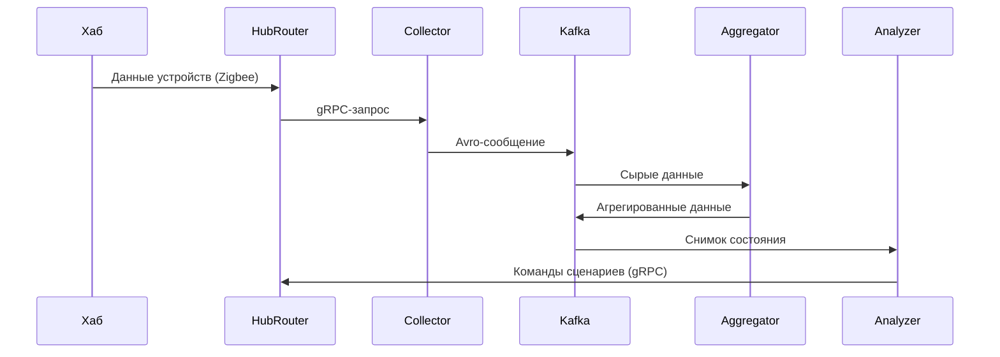
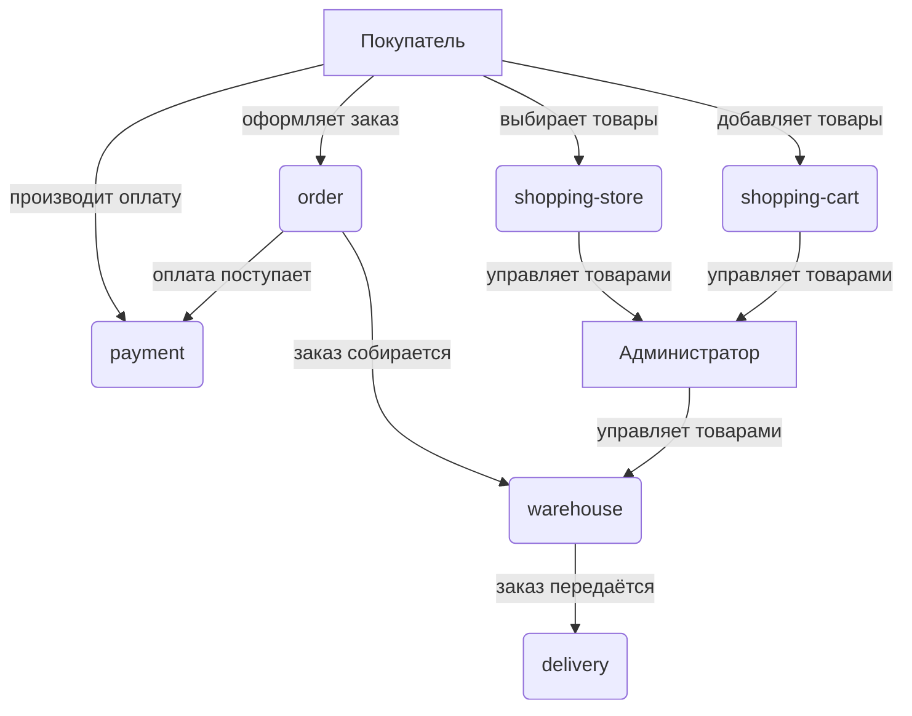

# Smart Home Telemetry Analysis Platform

Проект представляет собой платформу для сбора, обработки и анализа телеметрии умных устройств в экосистеме "Умного дома".

## 📌 Общее описание

Разработка системы для управления умными устройствами (датчики движения, освещения, температуры). Платформа:
- Принимает данные от домашних хабов
- Обрабатывает и агрегирует телеметрию
- Автоматически запускает сценарии на основе показаний датчиков

## 🏗 Архитектура системы

	
## 🏗 Основные микросервисы

### Hub Router (реализован)
- **Функции**:
  - Принимает данные от домашних хабов
  - Конвертирует в унифицированный формат

### Collector
- **Функции**:
  - Принимает данные от Hub Router
  - Конвертирует в Avro
  - Сохраняет в Kafka

### Aggregator
- **Функции**:
  - Агрегирует данные по хабам
  - Сохраняет снимки состояний в Kafka

### Analyzer
- **Функции**:
  - Анализирует данные
  - Запускает сценарии при выполнении условий

## 🛠 Технологический стек

| Компонент             | Технология         |
|-----------------------|--------------------|
| Языки программирования| Java (Spring Boot) |
| Брокер сообщений      | Apache Kafka       |
| Сериализация         | Apache Avro        |
| RPC                  | gRPC               |
| База данных          | PostgreSQL         |
| Service Discovery    | Eureka             |
| Конфигурация         | Spring Cloud Config|

## 📋 Поддерживаемые устройства

| Категория      | Устройства                     |
|----------------|-------------------------------|
| **Управление** | Хаб                           |
| **Освещение**  | Умные лампы (вкл/выкл)        |
| **Электропитание** | Умные розетки, выключатели |
| **Безопасность** | Датчики движения           |
| **Комфорт**    | Датчики температуры, освещения|

## 📊 Пример потока данных

# Smart Home Technologies - Интернет-магазин умных устройств

## Описание проекта
Интернет-магазин **Smart Home Technologies** — это микросервисное приложение для продажи устройств умного дома. Проект построен на Spring Cloud с использованием современных паттернов микросервисной архитектуры.

## Микросервисы
Система разделена на 6 независимых сервисов:
1. **shopping-store** – витрина товаров
2. **shopping-cart** – управление корзиной пользователя
3. **order** – обработка заказов
4. **warehouse** – управление складскими запасами
5. **payment** – обработка платежей
6. **delivery** – управление доставкой

## Технологический стек
- **Spring Boot 3.x**
- **Spring Cloud** (Config, Eureka, Feign, Circuit Breaker)
- **REST API** для межсервисного взаимодействия
- **Database per Service** (отдельные схемы БД для каждого сервиса)
- **PostgreSQL** (основная СУБД)

## Архитектура

## Требования
- Java 17+
- Docker (для развертывания инфраструктуры)
- PostgreSQL 14+

# Smart Home Technologies API

## API для обеспечения работы склада онлайн-магазина. Данный API позволяет управлять товарами на складе, проверять их наличие и получать информацию о складе.

## Теги

- **Склад магазина**: API для управления складом.

## Эндпоинты

### 1. Добавить новый товар на склад

- **Метод:** `PUT`
- **URL:** `/api/v1/warehouse`
- **Описание:** Добавить новый товар на склад.
- **Запрос:**
  - **Тело:** `NewProductInWarehouseRequest`
- **Ответы:**
  - `200`: Успешно.
  - `400`: Ошибка, товар с таким описанием уже зарегистрирован на складе.

### 2. Проверить количество товаров на складе

- **Метод:** `POST`
- **URL:** `/api/v1/warehouse/check`
- **Описание:** Предварительно проверить, что количество товаров на складе достаточно для данной корзины продуктов.
- **Запрос:**
  - **Тело:** `ShoppingCartDto`
- **Ответы:**
  - `200`: Общие сведения по бронированию.
  - `400`: Ошибка, товар из корзины не находится в требуемом количестве на складе.

### 3. Принять товар на склад

- **Метод:** `POST`
- **URL:** `/api/v1/warehouse/add`
- **Описание:** Принять товар на склад.
- **Запрос:**
  - **Тело:** `AddProductToWarehouseRequest`
- **Ответы:**
  - `400`: Нет информации о товаре на складе.

### 4. Получить адрес склада

- **Метод:** `GET`
- **URL:** `/api/v1/warehouse/address`
- **Описание:** Предоставить адрес склада для расчёта доставки.
- **Ответы:**
  - `200`: Актуальный адрес склада.

## API для обеспечения работы корзины онлайн-магазина. Данный API позволяет пользователям управлять своими корзинами, добавлять товары, изменять их количество и удалять товары из корзины.

## Теги

- **Корзина для онлайн-магазина**: API для управления корзиной покупок.

## Эндпоинты

### 1. Получить актуальную корзину

- **Метод:** `GET`
- **URL:** `/api/v1/shopping-cart`
- **Описание:** Получить актуальную корзину для авторизованного пользователя.
- **Параметры:**
  - `username` (обязательный): Имя пользователя.
- **Ответы:**
  - `200`: Ранее созданная или новая корзина.
  - `401`: Имя пользователя не должно быть пустым.

### 2. Добавить товар в корзину

- **Метод:** `PUT`
- **URL:** `/api/v1/shopping-cart`
- **Описание:** Добавить товар в корзину.
- **Параметры:**
  - `username` (обязательный): Имя пользователя.
- **Запрос:**
  - **Тело:** Отображение идентификатора товара на отобранное количество.
- **Ответы:**
  - `200`: Корзина товаров с изменениями.
  - `401`: Имя пользователя не должно быть пустым.

### 3. Деактивация корзины

- **Метод:** `DELETE`
- **URL:** `/api/v1/shopping-cart`
- **Описание:** Деактивация корзины товаров для пользователя.
- **Параметры:**
  - `username` (обязательный): Имя пользователя.
- **Ответы:**
  - `200`: OK.
  - `401`: Имя пользователя не должно быть пустым.

### 4. Изменить состав товаров в корзине

- **Метод:** `POST`
- **URL:** `/api/v1/shopping-cart/remove`
- **Описание:** Удалить указанные товары из корзины.
- **Параметры:**
  - `username` (обязательный): Имя пользователя.
- **Запрос:**
  - **Тело:** Массив идентификаторов товаров (UUID).
- **Ответы:**
  - `200`: Корзина товаров с изменениями.
  - `400`: Нет искомых товаров в корзине.
  - `401`: Имя пользователя не должно быть пустым.

### 5. Изменить количество товаров в корзине

- **Метод:** `POST`
- **URL:** `/api/v1/shopping-cart/change-quantity`
- **Описание:** Изменить количество товаров в корзине.
- **Параметры:**
  - `username` (обязательный): Имя пользователя.
- **Запрос:**
  - **Тело:** `ChangeProductQuantityRequest`
- **Ответы:**
  - `200`: Корзина товаров с изменениями.
  - `400`: Нет искомых товаров в корзине.
  - `401`: Имя пользователя не должно быть пустым.

## API для обеспечения работы витрины онлайн-магазина. Этот API позволяет пользователям получать информацию о товарах, добавлять новые товары, обновлять существующие и управлять их состоянием.

## Теги

- **Витрина онлайн-магазина**: API для управления ассортиментом товаров.

## Эндпоинты

### 1. Получение списка товаров

- **Метод:** `GET`
- **URL:** `/api/v1/shopping-store`
- **Описание:** Получение списка товаров по типу в пагинированном виде.
- **Параметры:**
  - `category` (обязательный): Категория товара (LIGHTING, CONTROL, SENSORS).
  - `pageable` (обязательный): Параметры пагинации.
- **Ответы:**
  - `200`: Очередная страница товаров в соответствии с типом.

### 2. Создание нового товара

- **Метод:** `PUT`
- **URL:** `/api/v1/shopping-store`
- **Описание:** Создание нового товара в ассортименте.
- **Запрос:**
  - **Тело:** Описательная часть вновь добавляемого товара (ProductDto).
- **Ответы:**
  - `200`: Товар создан с присвоением соответствующего ID.

### 3. Обновление товара

- **Метод:** `POST`
- **URL:** `/api/v1/shopping-store`
- **Описание:** Обновление товара в ассортименте.
- **Запрос:**
  - **Тело:** Описательная часть изменяемого товара (ProductDto).
- **Ответы:**
  - `200`: Товар обновлен, возвращается информация из БД.
  - `404`: Ошибка, товар по идентификатору в БД не найден.

### 4. Удаление товара

- **Метод:** `POST`
- **URL:** `/api/v1/shopping-store/removeProductFromStore`
- **Описание:** Удалить товар из ассортимента магазина.
- **Запрос:**
  - **Тело:** Идентификатор товара в БД на удаление.
- **Ответы:**
  - `200`: Признак успеха операции (true - если успешно, false - во всех остальных случаях).
  - `404`: Ошибка, товар по идентификатору в БД не найден.

### 5. Установка статуса по товару

- **Метод:** `POST`
- **URL:** `/api/v1/shopping-store/quantityState`
- **Описание:** Установка статуса по товару. API вызывается со стороны склада.
- **Запрос:**
  - **Тело:** Запрос на изменение статуса товара (SetProductQuantityStateRequest).
- **Ответы:**
  - `200`: Статус успешно обновлен.
  - `404`: Ошибка, товар по идентификатору в БД не найден.

### 6. Получение сведений по товару

- **Метод:** `GET`
- **URL:** `/api/v1/shopping-store/{productId}`
- **Описание:** Получить сведения по товару из БД.
- **Параметры:**
  - `productId` (обязательный): Идентификатор товара в БД.
- **Ответы:**
  - `200`: Актуальный товар со всеми сведениями из БД.
  - `404`: Ошибка, товар по идентификатору в БД не найден.
